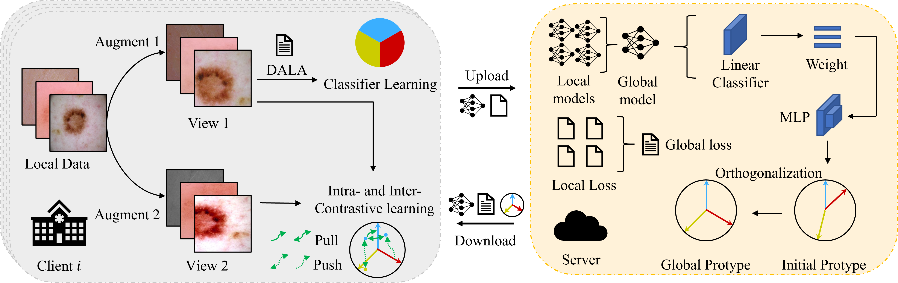

# FedIIC
This is the official implementation for the paper: "[FedIIC: Towards Robust Federated Learning for Class-Imbalanced Medical Image Classification](https://arxiv.org/abs/2206.13803)", which is accepted at `MICCAI'23` (Early Accept, top 14% in total 2253 submissions).  

<p align="center">
    
</p>


## Brief Introduction
This paper investigates federated learning using class-imbalanced (global) and heterogeneous (local) medical data.


## Related Work
- CReFF [[paper](https://arxiv.org/abs/2204.13399)] [[code](https://github.com/shangxinyi/CReFF-FL)]
- CLIMB [[paper](https://openreview.net/pdf?id=Xo0lbDt975)] [[code](https://github.com/shenzebang/Federated-Learning-Pytorch)]
- PRR-Imbalance [[paper](https://ieeexplore.ieee.org/abstract/document/9832948)] [[code](https://github.com/CityU-AIM-Group/PRR-Imbalance)]


## Dataset 
Please download the ICH dataset from [kaggle](https://www.kaggle.com/c/rsna-intracranial-hemorrhage-detection) and preprocess it follow this [notebook](https://www.kaggle.com/guiferviz/prepare-dataset-resizing-and-saving-as-png). Please download the ISIC 2019 dataset from this [link](https://challenge.isic-archive.com/data/#2019).


## Requirements
We recommend using conda to setup the environment, See the `requirements.txt` for environment configuration.


## Citation
If this repository is useful for your research, please consider citing:

```shell
@inproceedings{Wu2023FedIIC,
  title={FedIIC: Towards Robust Federated Learning for Class-Imbalanced Medical Image Classification},
  author={Wu, Nannan and Yu, Li and Yang, Xin and Cheng, Kwang-Ting and Yan, Zengqiang},
  booktitle={MICCAI},
  year={2023}
}
```

## Contact
For any questions, please contact 'wnn2000@hust.edu.cn'.
